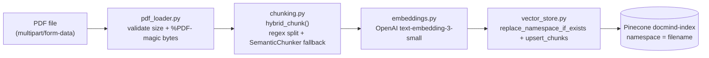
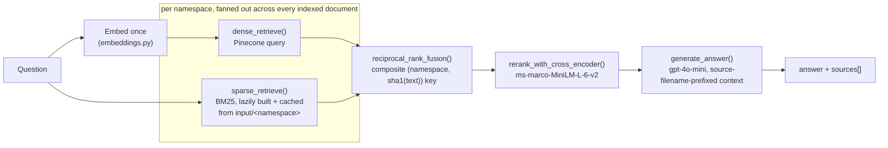

# DocMind Architecture

Two independent flows share one Pinecone index: **upload** (ingest a PDF into the index) and **query** (answer a question against everything currently indexed). See [README.md](README.md) for the API contract and [api/upload_api/PLAN.md](api/upload_api/PLAN.md) / [api/query_api/PLAN.md](api/query_api/PLAN.md) for design rationale.

## Upload flow — `POST /upload`

A PDF is chunked (regex-based structural split, falling back to semantic sub-splitting for oversized sections), each chunk is embedded, and the batch is upserted into Pinecone under a namespace equal to the sanitized filename. Re-uploading the same filename clears its old namespace first, so vectors never accumulate stale duplicates.

| Diagram step | Source |
|---|---|
| Validate upload | `api/services/pdf_loader.py` |
| Chunk | `api/services/chunking.py` |
| Embed | `api/services/embeddings.py` |
| Upsert | `api/services/vector_store.py` |
| Route | `api/routers/router.py` (`upload_pdf`) |

## Query flow — `POST /query`

The question is embedded once and reused across every namespace's dense query — retrieval fans out per-namespace (dense via Pinecone, sparse via a per-namespace BM25 index rebuilt from `input/<namespace>` with the same chunking config used at upload time), then merges via Reciprocal Rank Fusion keyed on `(namespace, sha1(chunk text))` so chunks never collide across documents or across dense/sparse chunkings. The fused candidates are reranked with a cross-encoder, and the top chunks (each prefixed with its source filename) become the LLM's context.

| Diagram step | Source |
|---|---|
| Embed question | `api/services/embeddings.py` |
| Dense retrieve | `api/services/retrieval.py` (`dense_retrieve`) |
| Sparse retrieve / BM25 cache | `api/services/bm25_index.py`, `api/services/retrieval.py` (`sparse_retrieve`) |
| Fuse | `api/services/retrieval.py` (`reciprocal_rank_fusion`, `hybrid_retrieve`) |
| Rerank | `api/services/reranking.py` |
| Generate | `api/services/generation.py` |
| Route | `api/routers/router.py` (`query_documents`) |

## Shared infrastructure

- **Pinecone `docmind-index`** — one index, one namespace per uploaded document; created/deleted via the `vector_db` Docker Compose service (`vector_db/create_index.py` / `delete_index.py`).
- **`api/app.py` lifespan** — loads the `OpenAIEmbeddings`/`SemanticChunker` (used by both `hybrid_chunk` at upload time and BM25 rebuilding at query time), the `CrossEncoder`, and initializes the per-namespace BM25 cache once at startup rather than per-request.
